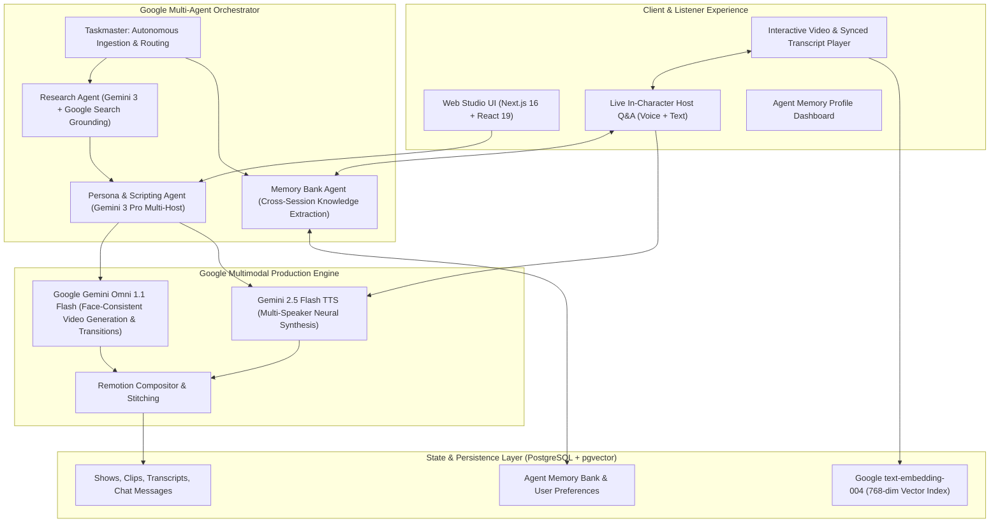

# Interdimensional Cable

### The World's First Autonomous, Adaptive On-Demand Podcast & Video Show Network

**Built for the [All Things Agentic Hackathon](https://allthingsagentichackathon.devpost.com/) (Google Cloud & Gemini)**

[](https://ai.google.dev/)
[](https://ai.google.dev/)
[](https://ai.google.dev/)
[](https://ai.google.dev/)

---

## 🎯 Executive Pitch: Moving from Static Broadcast to Autonomous Agentic Media

Traditional podcasts and comedy talk shows are static, broadcast media: recorded once for a generic audience, non-interactive, and impossible to steer.

**Interdimensional Cable** redefines the medium as an **autonomous, adaptive on-demand studio**. It combines **multi-agent orchestration**, **deep Google Search Grounding**, **Google Gemini Omni 1.1 Flash video generation**, **multi-speaker Gemini 2.5 Flash TTS**, and a **Persistent Agent Memory Bank**:

1. **On-Demand Custom Show Synthesis**: Turn any niche topic, URL, or breaking news item into a fully produced monologue or multi-host news desk episode in seconds.
2. **Persistent Memory Bank (Collaborative Partner Track)**: As you listen and converse with the podcast, the agent remembers your questions, concept mastery level, and humor preferences across sessions, dynamically adapting future episodes and explanations.
3. **Live In-Character Q&A & Tangents**: Interrupt the hosts mid-stream to ask questions. Hosts reply in their authentic comedic voices using Gemini Flash + Gemini TTS and can spin off instant 30-second audio tangent deep dives.
4. **Autonomous Ingestion Coordinator (Taskmaster Track)**: An event-driven coordinator monitors trending feeds (e.g. Hacker News), matches stories against your memory profile, picks the optimal host persona, and autonomously dispatches the entire production workflow.

---

## 🏆 Hackathon Track Alignment

### Track 1: The Collaborative Partner

- **Stateful Multi-Turn Dialogue**: Multi-turn in-character dialogue where the host references transcript cues and deep research.
- **Persistent Memory Bank (`user_memories`)**: Tracks concept mastery (e.g. beginner vs. expert in quantum computing), preferred humor styles, and interaction history across sessions.
- **Real-Time Context Retrieval (RAG)**: Uses **Google `text-embedding-004`** + pgvector cosine similarity to retrieve relevant transcript chunks and background knowledge.

### Track 2: The Taskmaster

- **Event-Driven Smart Coordinator (`scripts/autonomous-trend-agent.ts`)**: Monitors live RSS / Hacker News feeds without human intervention.
- **Autonomous Multi-Step Routing**: Evaluates story depth, selects host templates, provisions database records, and triggers background workflow execution.
- **Durable Resumable Workflows**: Resilient execution pipeline with real-time SSE progress streaming and crash recovery.

---

## 🏗️ System Architecture



---

## 🛠️ Google Agentic & Gemini Stack

| Component                      | Technology                                                | Purpose                                                                             |
| :----------------------------- | :-------------------------------------------------------- | :---------------------------------------------------------------------------------- |
| **Reasoning & Planning**       | **Gemini 3.7 Flash** (`@google/genai`)                    | Autonomous research, comedy dramaturgy, multi-host banter scripting.                |
| **Search Grounding**           | **Gemini Google Search Grounding**                        | Dynamic factual grounding for breaking news and technical topics.                   |
| **Video Clip Generation**      | **Google Gemini Omni 1.1 Flash** (`gemini-omni-1.1-flash`)| High-definition AI video generation (360p, 720p, 1080p, 4k) with `<FIRST_FRAME>` / `<LAST_FRAME>` transitions, multi-turn extensions up to 40s, and reference asset anchoring. |
| **Voice Synthesis (TTS)**      | **Gemini 3.1 Flash TTS** (`gemini-3.1-flash-tts-preview`) | Multi-speaker neural voice generation (used for shows, tangents, and 5m podcasts).  |
| **Vector Embeddings**          | **Google `text-embedding-004`** (768 dimensions)          | Transcript chunk embeddings and semantic vector search in PostgreSQL.               |
| **Memory Extraction**          | **Gemini 3.7 Flash**                                      | Autonomous extraction of concept mastery, humor preferences, and listener insights. |
| **Autonomous Coordinator**     | **Taskmaster Agent Runtime**                              | Event-driven trend ingestion, persona routing, and durable orchestration.           |
| **Video Delivery & Streaming** | **Mux Video + HLS**                                       | Adaptive bitrate streaming and multi-language track management.                     |
| **Video Compositor**           | **Remotion & FFmpeg**                                     | Serverless frame stitching, audio alignment, and visual caption overlays.           |

---

## 🚀 Quick Start

### 1. Prerequisites

- Node.js 20+
- PostgreSQL database with `pgvector` extension enabled
- Google Gemini API Key (`GEMINI_API_KEY` or `GOOGLE_GENERATIVE_AI_API_KEY`)
- Mux API credentials (`MUX_TOKEN_ID`, `MUX_TOKEN_SECRET`)

### 2. Installation & Setup

```bash
# Clone the repository
git clone https://github.com/arjunlohan/multimodal-frontier-hackathon-interdimensional-cable.git
cd multimodal-frontier-hackathon-interdimensional-cable

# Install dependencies
npm install

# Configure environment variables
cp .env.example .env.local
# Edit .env.local with your GEMINI_API_KEY, DATABASE_URL, and MUX credentials
```

### 3. Database Migration & Template Seeding

```bash
# Run database migrations (creates pgvector tables, memory bank, and shows)
npm run db:migrate

# Seed show templates (John Oliver, Seth Meyers, SNL Weekend Update)
npm run seed-templates
```

### 4. Launch the Application

```bash
# Start the development server
npm run dev
# Visit http://localhost:3000
```

### 5. Run the Autonomous Taskmaster Agent

```bash
# Triggers the autonomous news discovery, memory matching, and show generation agent
npm run agent:taskmaster
```

---

## 🧪 Testing & Verification

Run the automated test suite covering workflows, memory bank services, Gemini Omni video generators, and Remotion stitchers:

```bash
# Run all tests
npm run test
```

---

## 🎬 4-Minute Devpost Demo Script

| Timestamp       | Section                        | Key Visuals & Talking Points                                                                                                                                          |
| :-------------- | :----------------------------- | :-------------------------------------------------------------------------------------------------------------------------------------------------------------------- |
| **0:00 - 0:45** | **The Hook & Problem**         | Demo the limitation of static media vs. EchoCast's vision of on-demand autonomous comedy & knowledge shows.                                                           |
| **0:45 - 1:45** | **Show Creation & Pipeline**   | Create a show from a breaking tech link. Show Gemini 3 Google Search Grounding, Gemini Omni 1.1 Flash video clip generation, and Gemini 3.1 Flash multi-speaker TTS.   |
| **1:45 - 2:45** | **The Collaborative Partner**  | Watch playback. Interrupt host with a live question. Show in-character voice reply and the **Agent Memory Bank** adapting to the user's concept mastery in real-time. |
| **2:45 - 3:30** | **The Taskmaster Coordinator** | Run `npm run agent:taskmaster`. Show the autonomous agent reading Hacker News, matching memory preferences, and dispatching a durable workflow cycle.                 |
| **3:30 - 4:00** | **Architecture & Summary**     | Walk through the architecture diagram showing 100% Google Gemini & Cloud integration.                                                                                 |

---

## 📜 License

MIT License. Built for the **All Things Agentic Hackathon 2026**.
