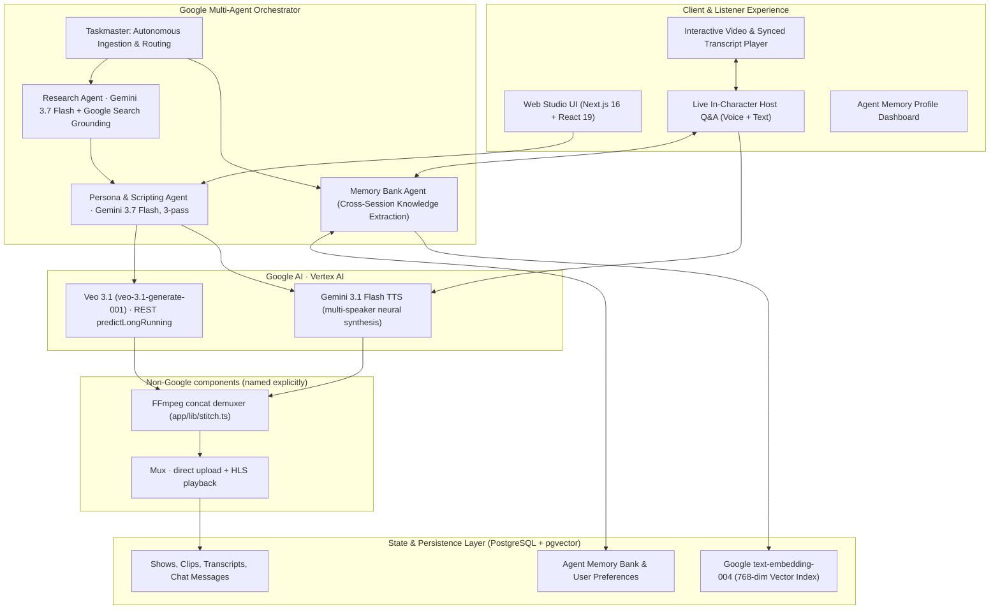

# Interdimensional Cable

### An autonomous, memory-adaptive on-demand podcast and video show network

**Built for the [All Things Agentic Hackathon](https://allthingsagentichackathon.devpost.com/) (Google Cloud & Gemini)**

[](https://ai.google.dev/)
[](https://cloud.google.com/vertex-ai)
[](https://ai.google.dev/)
[](https://ai.google.dev/)

---

## 🎯 Executive Pitch: Moving from Static Broadcast to Autonomous Agentic Media

Traditional podcasts and comedy talk shows are static, broadcast media: recorded once for a generic audience, non-interactive, and impossible to steer.

**Interdimensional Cable** redefines the medium as an **autonomous, adaptive on-demand studio**. It combines **multi-agent orchestration**, **Google Search grounding**, **Veo 3.1 video generation on Vertex AI** (`veo-3.1-generate-001`), **multi-speaker Gemini 3.1 Flash TTS**, and a **four-tier cognitive memory store** on Postgres/pgvector (`app/lib/memory-bank.ts`):

1. **On-Demand Custom Show Synthesis**: Turn any niche topic, URL, or breaking news item into a fully produced monologue or multi-host news desk episode in a single unattended run (roughly 2-5 minutes of wall clock for a 16-second video show; audio-only shows are faster).
2. **Persistent Memory Bank (Collaborative Partner Track)**: As you listen and converse with the podcast, the agent remembers your questions, concept mastery level, and humor preferences across sessions, dynamically adapting future episodes and explanations.
3. **Live In-Character Q&A & Tangents**: Interrupt the hosts mid-stream to ask questions. Hosts reply in their authentic comedic voices using Gemini Flash + Gemini TTS and can spin off instant 30-second audio tangent deep dives.
4. **Autonomous Ingestion Coordinator (Taskmaster Track)**: An event-driven coordinator monitors trending feeds (e.g. Hacker News), matches stories against your memory profile, picks the optimal host persona, and autonomously dispatches the entire production workflow.

---

## 🏆 Hackathon Track Alignment

### Track 1: The Collaborative Partner

- **Stateful Multi-Turn Dialogue**: Multi-turn in-character dialogue where the host references transcript cues and deep research.
- **Persistent Memory Bank (`user_memories`)**: Tracks concept mastery (e.g. beginner vs. expert in quantum computing), preferred humor styles, and interaction history across sessions.
- **Real-Time Context Retrieval (RAG)**: Uses **Google `text-embedding-004`** + pgvector cosine similarity to retrieve relevant transcript chunks and background knowledge.

### Track 2: The Taskmaster

- **Event-Driven Coordinator (`scripts/autonomous-trend-agent.ts`)**: Each cycle pulls top stories from the Hacker News Firebase API, ranks them against the persisted memory profile using Gemini 3.7 Flash structured output, routes to a host persona, provisions the show row, and dispatches the durable workflow. No human input.
- **Autonomous Multi-Step Routing**: Evaluates story depth, selects host templates, provisions database records, and triggers background workflow execution.
- **Durable Workflows**: Every stage is a Vercel Workflow `"use step"` boundary (`workflows/generate-show.ts`), so completed steps are checkpointed and never re-executed on retry. A failed Mux upload preserves the rendered file (`generated_shows.local_render_path`) so re-running costs no paid regeneration. The browser polls `generated_shows.status` for progress.

---

## 🏗️ System Architecture



---

## 🛠️ Google Agentic & Gemini Stack

| Component                      | Technology                                                                                               | Purpose                                                                                                                                                                                                                                                                                                                                                                   |
| :----------------------------- | :------------------------------------------------------------------------------------------------------- | :------------------------------------------------------------------------------------------------------------------------------------------------------------------------------------------------------------------------------------------------------------------------------------------------------------------------------------------------------------------------ |
| **Reasoning & Planning**       | **Gemini 3.7 Flash** (`@google/genai`)                                                                   | Autonomous research, comedy dramaturgy, multi-host banter scripting.                                                                                                                                                                                                                                                                                                      |
| **Search Grounding**           | **Gemini Google Search Grounding**                                                                       | Dynamic factual grounding for breaking news and technical topics.                                                                                                                                                                                                                                                                                                         |
| **Video Clip Generation**      | **Vertex AI Veo 3.1** (`veo-3.1-generate-001`) via REST `predictLongRunning` (`app/lib/vertex-video.ts`) | Video generation, pinned to 720p 16:9 by the show workflow. Continuity across turns via boundary-frame chaining (`extractFrame` → `firstFrame`) plus reference-asset anchoring for host face consistency. An alternate Gemini Developer API path (`gemini-omni-1.1-flash`, `app/lib/veo.ts`) is implemented behind `GEMINI_VIDEO_API_KEY` and is **not** the active path. |
| **Voice Synthesis (TTS)**      | **Gemini 3.1 Flash TTS** (`gemini-3.1-flash-tts-preview`)                                                | Multi-speaker neural voice generation (used for shows, tangents, and 5m podcasts).                                                                                                                                                                                                                                                                                        |
| **Vector Embeddings**          | **Google `text-embedding-004`** (768 dimensions)                                                         | Transcript chunk embeddings and semantic vector search in PostgreSQL.                                                                                                                                                                                                                                                                                                     |
| **Memory Extraction**          | **Gemini 3.7 Flash**                                                                                     | Autonomous extraction of concept mastery, humor preferences, and listener insights.                                                                                                                                                                                                                                                                                       |
| **Autonomous Coordinator**     | **Custom coordinator** (`scripts/autonomous-trend-agent.ts`) on the **Google GenAI SDK**                 | Pulls Hacker News top stories, ranks against the memory profile with Gemini 3.7 Flash structured output, provisions the show, dispatches the durable workflow.                                                                                                                                                                                                            |
| **Video Delivery & Streaming** | **Mux Video + HLS**                                                                                      | Adaptive bitrate streaming and multi-language track management.                                                                                                                                                                                                                                                                                                           |
| **Video Compositor**           | **FFmpeg** (`app/lib/stitch.ts`)                                                                         | Local concat-demuxer stitching with a 48 kHz AAC re-encode fallback. Remotion Lambda (AWS) renders the separate legacy social-clip feature and is **not** on the show path.                                                                                                                                                                                               |

---

## 🚀 Quick Start

### 1. Prerequisites

- Node.js 24.11.0 (see `.nvmrc`)
- `ffmpeg` on PATH (used to stitch clips: `brew install ffmpeg`)
- PostgreSQL 16 with the `pgvector` extension enabled
- Google Gemini API Key (`GEMINI_API_KEY` or `GOOGLE_GENERATIVE_AI_API_KEY`)
- Mux API credentials (`MUX_TOKEN_ID`, `MUX_TOKEN_SECRET`)

### 2. Installation & Setup

```bash
# Clone the repository
git clone https://github.com/arjunlohan/multimodal-frontier-hackathon-interdimensional-cable.git
cd multimodal-frontier-hackathon-interdimensional-cable

# Install dependencies
npm install

# Configure environment variables
cp .env.example .env.local
# Edit .env.local with your GEMINI_API_KEY, DATABASE_URL, and MUX credentials
```

### 3. Database Migration & Template Seeding

```bash
# Run database migrations (creates pgvector tables, memory bank, and shows)
npm run db:migrate

# Seed show templates (John Oliver, Seth Meyers, SNL Weekend Update)
npm run seed-templates
```

### 4. Launch the Application

```bash
# Start the development server
npm run dev
# Visit http://localhost:3000
```

### 5. Run the Autonomous Taskmaster Agent

```bash
# Triggers the autonomous news discovery, memory matching, and show generation agent
npm run agent:taskmaster
```

---

## 🧪 Testing & Verification

13 suites, 320 tests, all passing. Coverage spans the durable show workflow, the four-tier memory bank, the video engine, multi-speaker TTS, the FFmpeg stitcher, and the skill/dramaturgy registries, including adversarial "challenger" suites that attack boundary conditions.

```bash
# Run all tests
npm run test
```

---

## 🎬 4-Minute Devpost Demo Script

| Timestamp       | Section                        | Key Visuals & Talking Points                                                                                                                                                                                                                                                       |
| :-------------- | :----------------------------- | :--------------------------------------------------------------------------------------------------------------------------------------------------------------------------------------------------------------------------------------------------------------------------------- |
| **0:00 - 0:45** | **The Hook & Problem**         | Demo the limitation of static broadcast media against Interdimensional Cable's on-demand, memory-adaptive show network.                                                                                                                                                            |
| **0:45 - 1:45** | **Show Creation & Pipeline**   | Create a show from a breaking tech link. Show Gemini 3.7 Flash with Google Search grounding, Veo 3.1 video clip generation on Vertex AI, and Gemini 3.1 Flash multi-speaker TTS.                                                                                                   |
| **1:45 - 2:45** | **The Collaborative Partner**  | Watch playback. Interrupt host with a live question. Show in-character voice reply and the **Agent Memory Bank** adapting to the user's concept mastery in real-time.                                                                                                              |
| **2:45 - 3:30** | **The Taskmaster Coordinator** | Run `npm run agent:taskmaster`. Show the autonomous agent reading Hacker News, matching memory preferences, and dispatching a durable workflow cycle.                                                                                                                              |
| **3:30 - 4:00** | **Architecture & Summary**     | Walk the architecture diagram: Gemini 3.7 Flash and Veo 3.1 on Vertex AI for all model inference, and Cloud SQL for PostgreSQL backing all application state. Mux (HLS delivery) and Remotion Lambda (legacy social clips) are called out explicitly as the non-Google components. |

---

## 🗺️ Repository Map

| Path                                | What lives here                                                                                                                                                        |
| :---------------------------------- | :--------------------------------------------------------------------------------------------------------------------------------------------------------------------- |
| `workflows/generate-show.ts`        | The durable production pipeline. Nine checkpointed `"use step"` boundaries: research → script → voice → clips → stitch → upload.                                       |
| `app/lib/dramaturgy/`               | The three-pass writers' room. `pass1-research` (grounded research), `pass2-head-writer` (structure and jokes), `pass3-voice-prune` (persona voice + trim to duration). |
| `app/lib/memory-bank.ts`            | Four-tier cognitive memory: working, episodic, procedural, semantic. Includes Ebbinghaus confidence decay and reinforcement.                                           |
| `app/lib/vertex-video.ts`           | Veo 3.1 over Vertex REST `predictLongRunning`. The active video path.                                                                                                  |
| `app/lib/veo.ts`                    | The Gemini Developer API video path (`gemini-omni-1.1-flash`), plus rate limiting, RAI handling, and frame chaining. Inactive by default.                              |
| `app/lib/genai.ts`                  | Single shared GenAI client factory. Routes express (`AQ.*`) keys to Vertex.                                                                                            |
| `app/lib/tts.ts`                    | Multi-speaker synthesis with host gender/accent inference driven by the show template.                                                                                 |
| `app/lib/stitch.ts`                 | FFmpeg concat-demuxer stitching with an AAC re-encode fallback.                                                                                                        |
| `scripts/autonomous-trend-agent.ts` | The Taskmaster coordinator: discover → rank against memory → route → provision → dispatch.                                                                             |
| `db/schema.ts`                      | State model. pgvector `vector(768)` with an HNSW cosine index.                                                                                                         |
| `app/watch/[showId]/`               | Player, synced transcript, in-character Q&A, audio tangents, memory profile card.                                                                                      |

---

## 🔬 Engineering Insights

Three things that cost real time and are not in any documentation:

**1. `AQ.*` and `AIza` keys are different auth surfaces, and the prefix does not tell you which.**
Express-mode keys exist on _both_ the Gemini Developer API and Vertex, but they are not interchangeable. A client built without `vertexai: true` returns `403 PERMISSION_DENIED` against a Vertex express key. This is centralized in `app/lib/genai.ts` so it can only be got wrong once.

**2. Express keys cannot address long-running video operations through the SDK.**
`generateVideos` needs an explicit `projects/{p}/locations/{l}` path, which the express-key initializer rejects (`project`/`location` are mutually exclusive with `apiKey`). The workaround is a hand-rolled REST client that calls `predictLongRunning` and polls `fetchPredictOperation` directly — `app/lib/vertex-video.ts`.

**3. Google Search grounding is incompatible with `responseMimeType: "application/json"`.**
You must choose grounded-and-unstructured or structured-and-ungrounded. Worse, the failure is silent: an 8192-token cap truncated the grounded research brief mid-object, JSON parsing failed, and the pipeline fell back to mock research that fabricated `example.com` sources while reporting success. Fixed by raising the cap to 32768 and parsing defensively. **The lesson generalizes: a fallback that silently substitutes fake data is worse than a crash.**

We also hand-rolled the memory tier on Postgres/pgvector rather than using Vertex AI Agent Engine Memory Bank, because retrieval needed to happen in the same transaction as show metadata.

---

## ⚠️ Known Limitations

Stated up front rather than left to be discovered:

- **Single-tenant.** `"default_user"` is hardcoded. There is no auth; every session shares one memory profile.
- **Workflow run store.** Off Vercel, the Workflow DevKit persists runs to the local filesystem. A production deployment would move the step queue to Cloud Tasks or Pub/Sub.
- **`vertex-video.ts` has no unit coverage.** It is exercised manually via `npm run test:veo`, which costs real money, so it is not in CI.
- **Mux free tier caps at 10 assets.** The workflow runs a capacity preflight and refuses to start rather than spend render money it cannot store, but you must delete assets to keep generating.
- **`gemini-omni-1.1-flash` is implemented but inactive.** It requires AI Studio prepay credits on the key's project; ours has none, so video runs on Veo 3.1 via Vertex instead. Both paths are in the repo.
- **Retry is automatic, not manual.** Steps are checkpointed and resume on retry, but there is no user-facing "resume this run" control yet.

---

## 🏅 Bonus Integrations

- **Veo** — `veo-3.1-generate-001` generates every video clip, through Vertex AI (`app/lib/vertex-video.ts`).

---

## 📜 License

MIT License. Built for the **All Things Agentic Hackathon 2026**.
